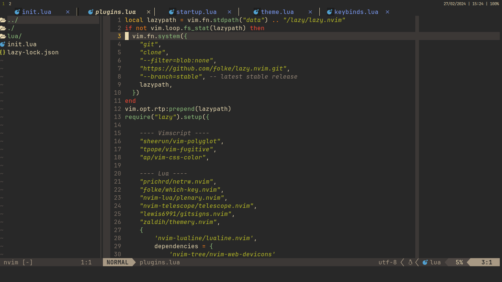

# Minhas configurações do Neovim

Essa configuração é um crime contra a humanidade em termos de organização.  
**TUDO** é configurado dentro do arquivo init.lua.

Não existe nenhum motivo lógico pra fazer isso, e essa configuração é um  
exemplo perfeito do porquê você não deve fazer isso.

Apesar disso, ela é uma configuração perfeitamente utilizável, só faltando uma  
configuração para suporte de LSP.  

